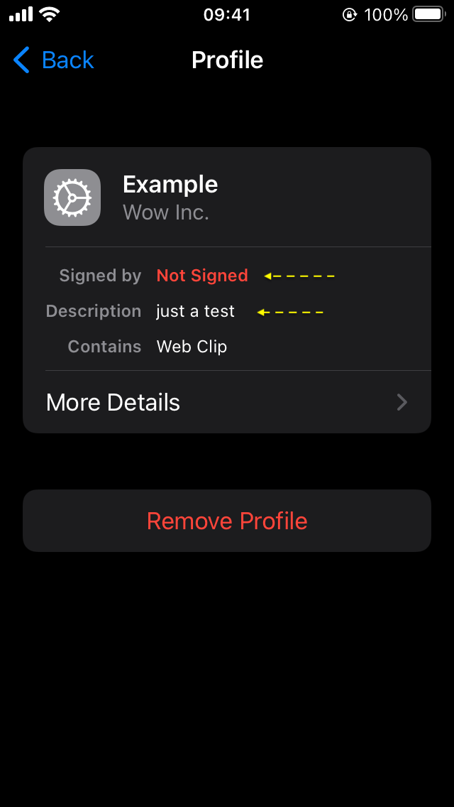
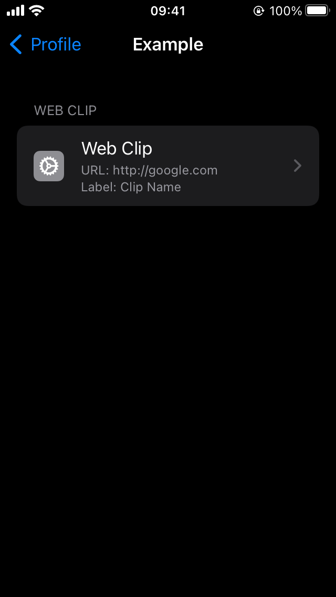
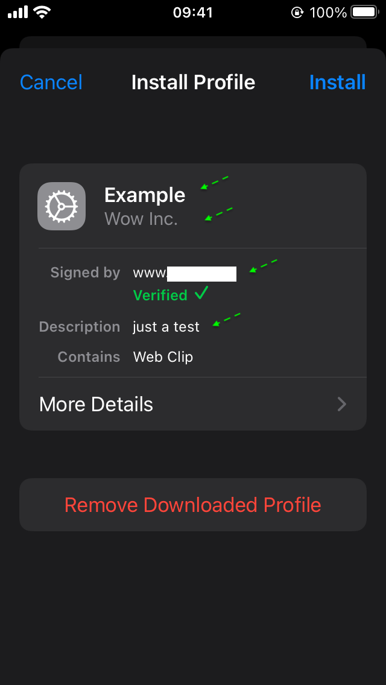
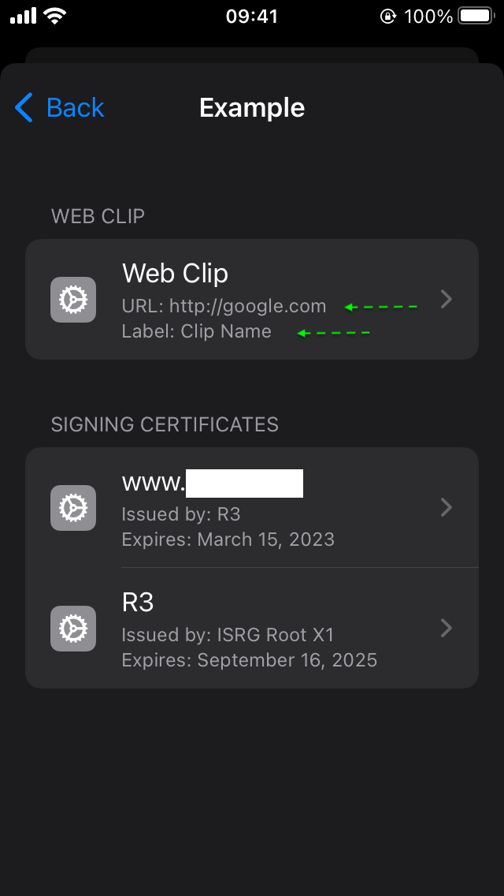
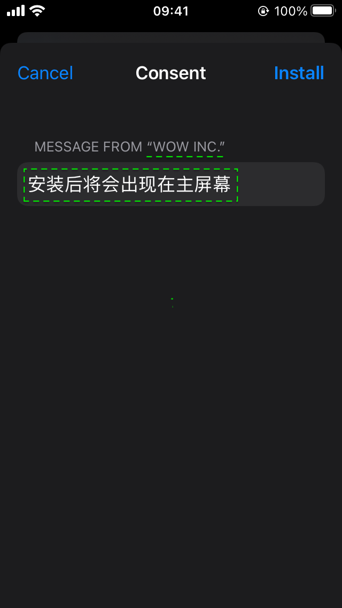
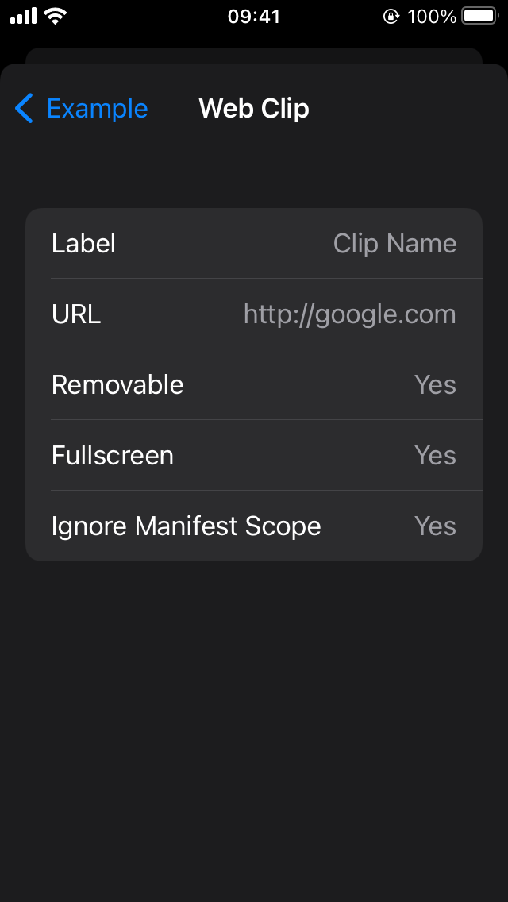

# clip

Make an excellent iOS Web clip into `.mobileconfig` file, and sign it.

## Usage

```
./clip -h
NAME:
   clip - make an excellent clip

USAGE:
   clip [global options] command [command options] [arguments...]
      arguments: just place your args [label url icon]... order by order

COMMANDS:
   help, h  Shows a list of commands or help for one command

GLOBAL OPTIONS:
   --sign            Need signing (default: false)
   --cert FILE       ssl_certificate FILE for sign (in `PEM` format) (default: "certs/cert.pem")
   --privkey FILE    ssl_certificate_key FILE for sign (in `PEM` format) (default: "certs/privkey.pem")
   --chain FILE      ssl_trusted_certificate FILE for sign (in `PEM` format) (default: "certs/chain.pem")
   --duration value  DurationUntilRemoval (in hours) (default: 0)
   --date value      RemovalDate (in format: 2006-01-02 15:04)
   --name value      PayloadDisplayName (default: "Untitled")
   --desc value      PayloadDescription (default: "Web Clip Installation")
   --org value       PayloadOrganization (default: "Excellent Inc.")
   --consent value   ConsentText (default: "It will appear on the main screen.")
   --help, -h        show help (default: false)
```

## Example

```bash
./clip --sign=true --date '2024-01-02 00:00' --name 'Example' --desc 'just a test' \
  --org 'Wow Inc.' --consent '安装后将会出现在主屏幕' 'Clip Name' 'http://google.com' 'test.jpg'
# out Example_unsigned.mobileconfig Example_signed.mobileconfig
```

| desc                 | img                                   | 
|----------------------|---------------------------------------|
| unsigned install     |       |
| unsigned more detail |  |
| signed install       |         |
| signed more detail   |    |
| install consent |        |
| web clip content |       |
